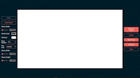

# JScribble - the online doodling app

[Live Here!](https://jscribble.netlify.app)

### Description of you application:
JScribble is a small drawing application that allows you to doodle and draw on a canvas to express your ideas

### Features:
#### With JScribble you can:
- draw, color, and stamp to your hearts content
- save your creation as a .png image
- see other's work in the gallery
- sign up to upload your own creations to your gallery and share them with the world

#### Created By: Paul Graham Jr.
[LinkedIn](https://www.linkedin.com/in/pgrahamjr/)
[Personal Website](https://paulgrahamjr.com/)

#### Build instructions:
- clone this repo
- run 'npm run build'

## Personal Goals
- draw freeform lines on canvas (Done!)
- clear canvas (Done!)
- drawing parameters (change pen size, pen color) (Done!)
- draw straight lines on canvas (Done!)
- eraser (Done!)
- stamp (fill clicked area with specified shape) (Done!)
- shape parameters (change shape size, fill color, stroke color) (Done!)
- create landing page (Done!)
- style drawing page (Done!)
- style landing page (Done!)

## Stretch Goals
- saving images as .png (Done!)
- fill area with color (Need to find performant method)
- mobile optimization
- extra stamp options (star, heart, fibo flower, other complex shapes)
- canvas layers
- save working data (with layers)

### Known Issues
- Canvas clears on screen resize
- On active screen resize, draw position becomes desynced (clears on refresh though... state issue?)
- Draw position becomes desynced over time? (needs more testing, especially noticeable on smaller pen sizes)

### Potential Issues?
- Undo stack depth is currently uncapped, could cause trouble?